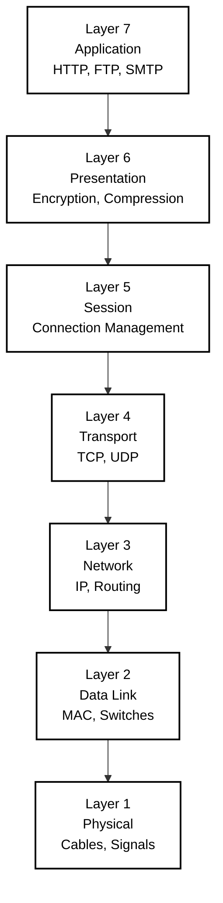

  NetPractice Made Simple

<div align="center">
  
</div>

# OSI Model Reference

<div align="center">

## The 7-Layer Network Architecture



</div>

## Overview

The **OSI (Open Systems Interconnection) Model** is a conceptual framework that standardizes network communication into 7 distinct layers. Each layer has specific responsibilities and communicates with the layers directly above and below it.

---

## Layer Descriptions

### Layer 7 - Application
**What users interact with**
- Protocols: HTTP, HTTPS, FTP, SMTP, DNS
- Where applications access network services
- Example: Web browsers, email clients

### Layer 6 - Presentation
**Data translation and encryption**
- Converts data formats between application and network
- Handles encryption/decryption
- Data compression
- Example: SSL/TLS, JPEG, ASCII

### Layer 5 - Session
**Connection management**
- Establishes, maintains, and terminates sessions
- Synchronization and dialog control
- Example: NetBIOS, RPC

### Layer 4 - Transport
**End-to-end communication**
- Protocols: TCP (reliable), UDP (fast)
- Segmentation and flow control
- Port numbers (0-65535)
- Example: TCP port 80 for HTTP

### Layer 3 - Network
**Routing and addressing**
- Protocols: IP, ICMP, routing protocols
- Logical addressing (IP addresses)
- Packet forwarding between networks
- Example: Routers operate here

### Layer 2 - Data Link
**Node-to-node transfer**
- Protocols: Ethernet, Wi-Fi (802.11)
- MAC addresses
- Error detection
- Example: Switches operate here

### Layer 1 - Physical
**Physical transmission**
- Cables, wireless signals
- Electrical/optical signals
- Network hardware
- Example: Ethernet cables, fiber optics, radio waves

---

## Mnemonic to Remember

**Top to Bottom:** "All People Seem To Need Data Processing"  
**Bottom to Top:** "Please Do Not Throw Sausage Pizza Away"

---

## Data Flow

```
Application Layer    →  Data
Presentation Layer   →  Data
Session Layer        →  Data
Transport Layer      →  Segments
Network Layer        →  Packets
Data Link Layer      →  Frames
Physical Layer       →  Bits
```

---

## Key Concepts

- **Encapsulation**: Each layer adds its own header as data moves down
- **Decapsulation**: Headers are removed as data moves up
- **PDU (Protocol Data Unit)**: Data at each layer has a specific name
- **Peer Communication**: Each layer communicates with its corresponding layer on the receiving end

---

## Common Protocols by Layer

| Layer | Protocols |
|-------|-----------|
| 7 - Application | HTTP, HTTPS, FTP, SMTP, DNS, SSH |
| 6 - Presentation | SSL/TLS, MIME, JPEG, GIF |
| 5 - Session | NetBIOS, PPTP, RPC |
| 4 - Transport | TCP, UDP |
| 3 - Network | IP, ICMP, ARP, OSPF, BGP |
| 2 - Data Link | Ethernet, PPP, 802.11 (Wi-Fi) |
| 1 - Physical | Ethernet cables, USB, Bluetooth |

---

## Resources

- [OSI Model - Wikipedia](https://en.wikipedia.org/wiki/OSI_model)
- [Cloudflare - What is the OSI Model?](https://www.cloudflare.com/learning/ddos/glossary/open-systems-interconnection-model-osi/)
