<div align="center">

# 🌐 NetPractice Made Simple

*This project has been created as part of the 42 curriculum by elel-m-b*

---
</div>

## 📖 Description

NetPractice is a network configuration training project designed to develop practical understanding of TCP/IP addressing and network topology. The project presents a series of networking exercises where you configure network devices to establish proper communication between hosts.

The goal is to master fundamental networking concepts by solving increasingly complex scenarios involving IP addressing, subnet masks, routing tables, and network segmentation. Each level requires configuring network interfaces, routers, and establishing routes to ensure all devices can communicate according to specific requirements.

Through hands-on problem-solving, this project builds essential skills for network administration, system configuration, and understanding how data flows across interconnected systems.

---

## 🚀 Instructions

### Prerequisites
- A web browser (Chrome, Firefox, Safari, or Edge)
- Basic understanding of binary and hexadecimal numbering systems

### Installation

```bash
# Clone the repository
git clone https://github.com/elel-m-b/netpractice.git
cd netpractice
```

No compilation required — this is a web-based training interface.

### Execution

1. Open `index.html` in your web browser
2. Navigate through the 10 levels using the interface
3. For each level:
   - Analyze the network topology diagram
   - Fill in the missing IP addresses, subnet masks, and routes
   - Click "Check again" to validate your configuration
   - Export your solution using the "Export" button when correct

### 💡 Usage Tips

- Start with the interfaces closest to the destination
- Calculate subnet ranges carefully to avoid overlapping networks
- Remember that routers connect different networks
- Use the smallest possible subnet that accommodates the required hosts
- Default route (0.0.0.0/0) can simplify routing table entries

---

## ✨ Features

| Feature | Description |
|---------|-------------|
| **10 Progressive Levels** | Gradually increasing difficulty from basic IP configuration to complex routing scenarios |
| **Interactive Network Diagrams** | Visual representation of hosts, switches, routers, and their connections |
| **Real-time Validation** | Immediate feedback on configuration correctness |
| **Export/Import Functionality** | Save and load your solutions for review |
| **Practical Application** | Simulates real-world networking challenges |

---

## 📡 Networking Fundamentals

### IP Address Overview

An **IP address** (Internet Protocol address) is a unique numerical identifier assigned to each device on a network. It serves two main purposes: identifying the host and providing the location of the host in the network.


**Structure:**
- IPv4 addresses consist of **4 bytes (32 bits)** total
- Written in dotted decimal notation: `192.168.1.1`
- Each byte (octet) ranges from **0 to 255**
- Example breakdown:
  - `192.168.1.1`
  - Binary: `11000000.10101000.00000001.00000001`
  - Each section is 8 bits (1 byte)

**Address Classes:**
- **Class A**: 1.0.0.0 to 126.255.255.255 (Large networks)
- **Class B**: 128.0.0.0 to 191.255.255.255 (Medium networks)
- **Class C**: 192.0.0.0 to 223.255.255.255 (Small networks)

---

### Public IP vs Private IP


**Public IP Addresses:**
- Globally unique addresses assigned by ISPs
- Routable on the internet
- Visible to the outside world
- Used to identify your network on the internet
- Example: `203.0.113.5`

**Private IP Addresses (RFC 1918):**
Reserved address ranges for internal networks, not routable on the internet:

- **Class A**: `10.0.0.0` to `10.255.255.255` (10.0.0.0/8)
- **Class B**: `172.16.0.0` to `172.31.255.255` (172.16.0.0/12)
- **Class C**: `192.168.0.0` to `192.168.255.255` (192.168.0.0/16)

**Key Differences:**
- Private IPs allow multiple devices to share one public IP via NAT (Network Address Translation)
- Private networks are isolated from direct internet access
- Routers translate private IPs to public IPs for internet communication
- Private IPs can be reused across different organizations

---

### Subnet Mask

A **subnet mask** determines which portion of an IP address represents the network and which part represents the host.

**Purpose:**
- Divides IP address into network and host portions
- Enables network segmentation and organization
- Controls the size of a network (number of available hosts)

**Common Subnet Masks:**

| CIDR Notation | Subnet Mask | Usable Hosts | Use Case |
|---------------|-------------|--------------|----------|
| /8 | 255.0.0.0 | 16,777,214 | Massive networks |
| /16 | 255.255.0.0 | 65,534 | Large organizations |
| /24 | 255.255.255.0 | 254 | Small office networks |
| /25 | 255.255.255.128 | 126 | Small departments |
| /26 | 255.255.255.192 | 62 | Very small subnets |
| /30 | 255.255.255.252 | 2 | Point-to-point links |

**Example:**
- IP: `192.168.1.10`
- Mask: `255.255.255.0` (/24)
- Network: `192.168.1.0`
- Host portion: `.10`
- Broadcast: `192.168.1.255`
- Usable range: `192.168.1.1` to `192.168.1.254`

**Calculation Tips:**
- /24 means the first 24 bits are network, last 8 bits are host
- Formula for usable hosts: 2^(host bits) - 2
- Subtract 2 for network address and broadcast address

---

### Router

A **router** is a network device that forwards data packets between different networks based on IP addresses.

**Key Functions:**
- **Connects different networks**: Links separate IP networks together
- **Routes traffic**: Determines the best path for data packets
- **Maintains routing tables**: Stores information about network destinations
- **Network segmentation**: Isolates broadcast domains

**Router Components:**
- **Interfaces**: Each interface connects to a different network
- **Routing Table**: Contains destination networks and next-hop information
- **Default Gateway**: Router's IP address used by hosts to reach other networks

**Routing Table Example:**
```
Destination     | Next Hop      | Interface
----------------|---------------|----------
192.168.1.0/24  | 0.0.0.0       | eth0 (directly connected)
10.0.0.0/8      | 192.168.1.254 | eth0
0.0.0.0/0       | 172.16.0.1    | eth1 (default route)
```

**Important Concepts:**
- **Default Route (0.0.0.0/0)**: The path used when no specific route matches
- **Next Hop**: The IP address of the next router in the path
- **Directly Connected**: Networks attached to the router's interfaces
- Routers operate at **Layer 3 (Network Layer)** of the OSI model

**In NetPractice:**
- Each router interface must have an IP in the network it connects to
- Routers need routes to reach non-directly-connected networks
- The default gateway on hosts points to the router interface IP

---

### Switch

A **switch** is a network device that connects multiple devices within the same network and forwards data based on MAC addresses.

**Key Functions:**
- **Connects devices in a LAN**: Links computers, printers, and servers
- **Layer 2 operation**: Works at the Data Link layer using MAC addresses
- **MAC address table**: Learns which devices are on which ports
- **Broadcasts**: Forwards broadcasts to all connected devices

**How Switches Work:**
1. Receives frame on a port
2. Reads destination MAC address
3. Looks up MAC in address table
4. Forwards frame only to the destination port (or floods if unknown)

**Switch vs Router:**

| Feature | Switch | Router |
|---------|--------|--------|
| **OSI Layer** | Layer 2 (Data Link) | Layer 3 (Network) |
| **Addressing** | MAC addresses | IP addresses |
| **Purpose** | Connect devices in same network | Connect different networks |
| **Broadcast Domain** | Forwards broadcasts | Blocks broadcasts |
| **Intelligence** | Learns MAC addresses | Makes routing decisions |

**In NetPractice:**
- Switches are transparent (don't need configuration)
- All devices connected to a switch are in the same network
- Switches don't separate networks—use routers for that

---

### ARP (Address Resolution Protocol)

**ARP** is a protocol used to map IP addresses to MAC addresses on a local network.

**Why ARP is Needed:**
- Network Layer (Layer 3) uses IP addresses
- Data Link Layer (Layer 2) uses MAC addresses
- ARP bridges the gap between these layers

**ARP Request Process:**

1. **Host wants to communicate**: Host A (192.168.1.10) wants to send data to Host B (192.168.1.20)
2. **ARP Request (Broadcast)**:
   - Host A broadcasts: "Who has 192.168.1.20? Tell 192.168.1.10"
   - Sent to MAC address: `FF:FF:FF:FF:FF:FF` (broadcast)
   - All devices on the network receive it
3. **ARP Reply (Unicast)**:
   - Host B responds: "192.168.1.20 is at MAC 00:1A:2B:3C:4D:5E"
   - Sent directly to Host A's MAC address
4. **Cache the mapping**:
   - Host A stores this in its ARP cache for future use
   - Cache expires after a timeout (typically 20 minutes)

**ARP Cache Example:**
```
IP Address      | MAC Address          | Type
----------------|----------------------|--------
192.168.1.1     | 00:11:22:33:44:55   | Dynamic
192.168.1.20    | 00:1A:2B:3C:4D:5E   | Dynamic
192.168.1.254   | AA:BB:CC:DD:EE:FF   | Dynamic
```

**Key Points:**
- ARP only works within the same subnet/broadcast domain
- Switches forward ARP broadcasts to all ports
- Routers do not forward ARP broadcasts (boundary of broadcast domain)
- ARP is vulnerable to spoofing attacks (ARP poisoning)

**Commands to View ARP:**
- Linux/Mac: `arp -a`
- Windows: `arp -a`
- Clear cache: `arp -d` (may require admin privileges)

---

## 🔌 OSI Model Reference

### The 7-Layer Network Architecture

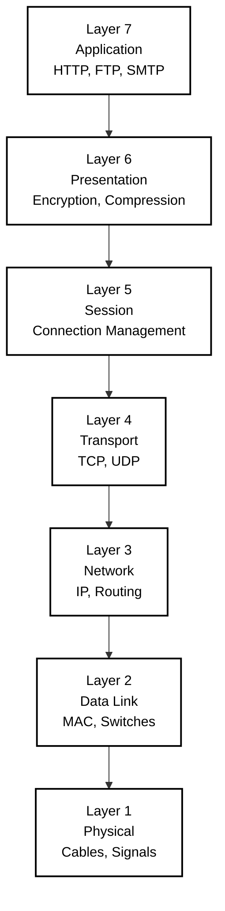

### Overview

The **OSI (Open Systems Interconnection) Model** is a conceptual framework that standardizes network communication into 7 distinct layers. Each layer has specific responsibilities and communicates with the layers directly above and below it.

---

### Alternative OSI Visualizations

#### Color-Coded OSI Model

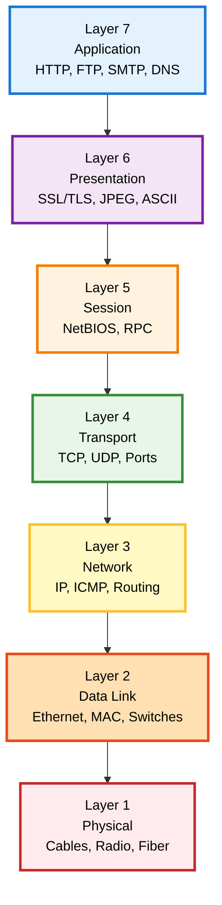

#### OSI Model with PDU Names

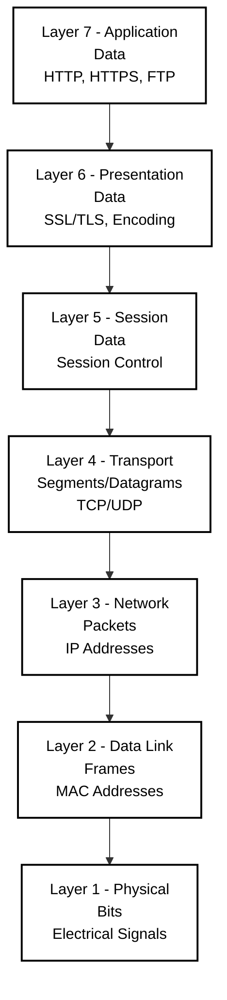

#### Encapsulation Process

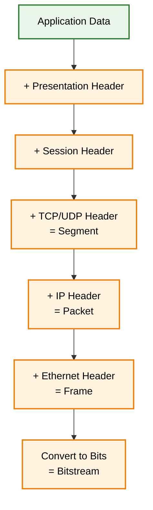

#### Network Devices by OSI Layer

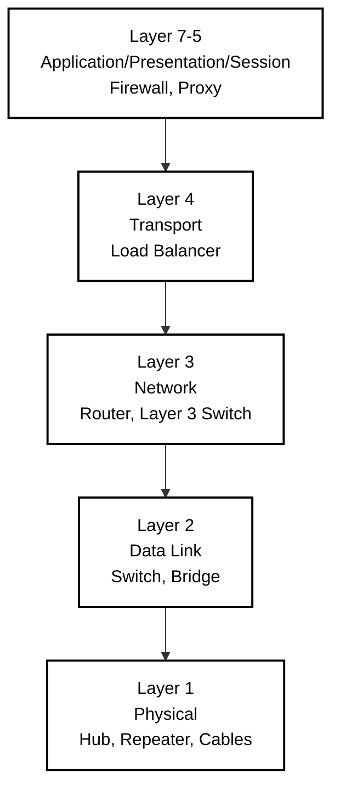

---

## 🎯 Project Levels

Navigate through 10 progressive networking challenges, each building upon previous concepts:

### Level 1 - Basic IP Configuration
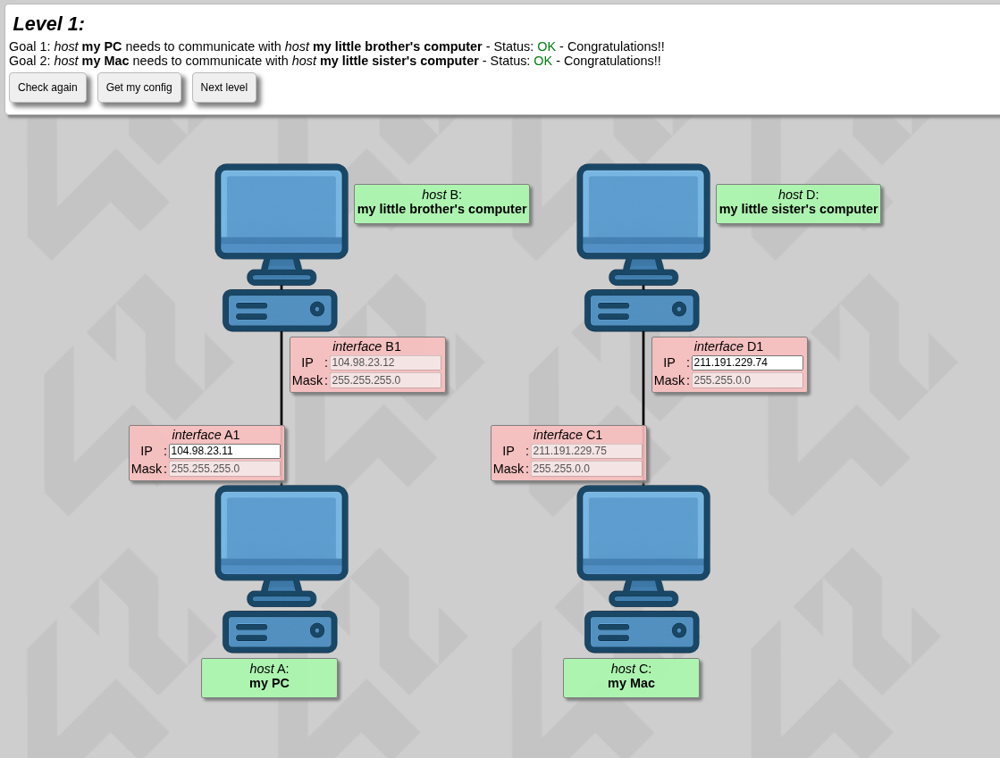

Introduction to IP addressing and basic network connectivity.

**📘 Learning Concepts:**
* Understanding IPv4 address structure
* Using subnet masks to identify networks
* Recognizing network and broadcast addresses
* Determining valid host IP ranges

---

### Level 2 - Subnet Fundamentals
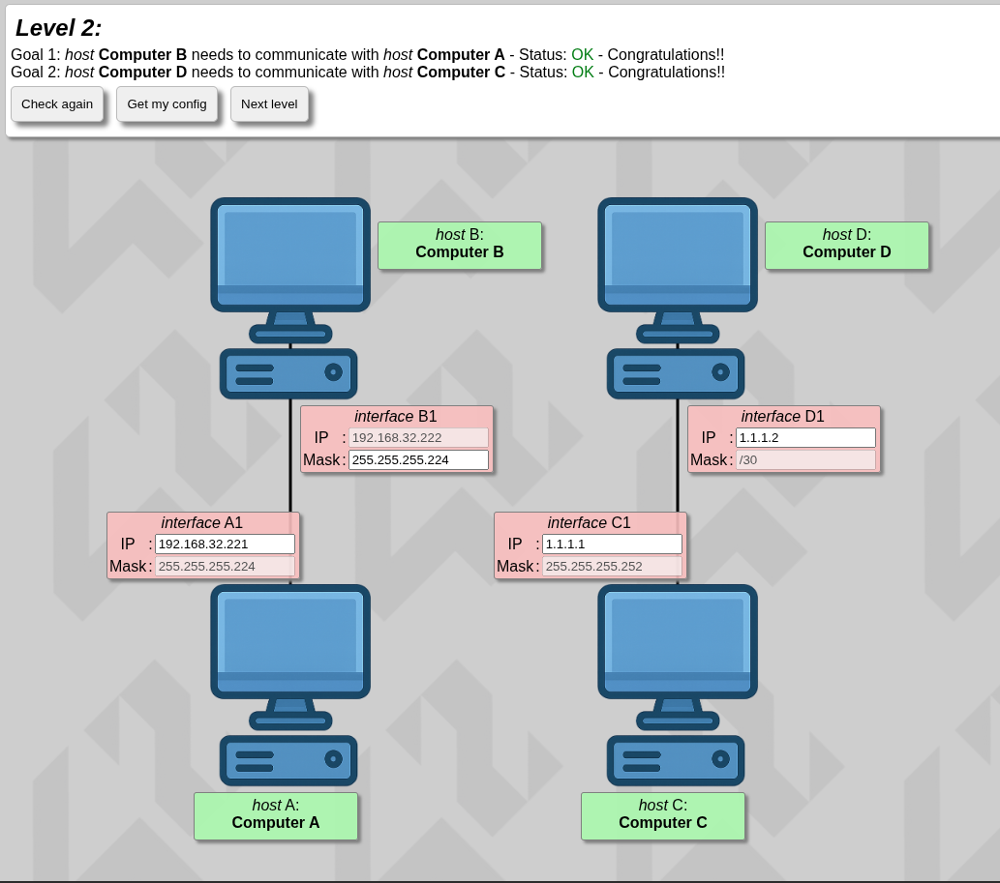

Learn subnet mask calculations and network segmentation.

**📘 Learning Concepts:**
* Applying subnet masks of different sizes
* Understanding binary representation of IP addresses
* Calculating subnet ranges and usable hosts
* Introduction to CIDR (slash `/`) notation

---

### Level 3 - Multiple Networks
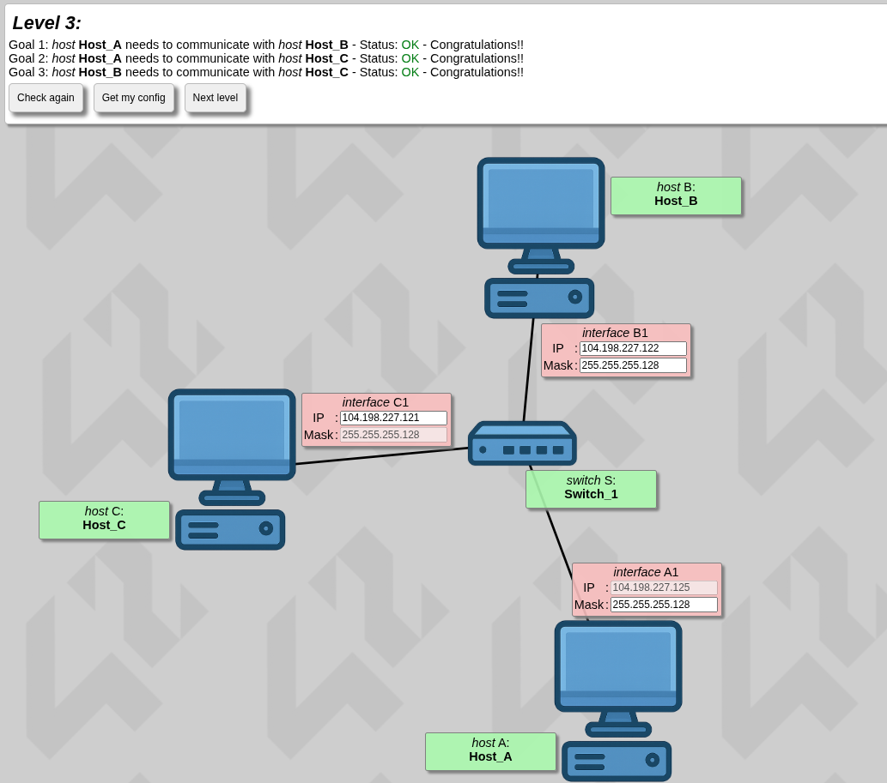

Configure multiple isolated network segments.

**📘 Learning Concepts:**
* Understanding the role of a switch in a network
* Connecting multiple hosts within the same network
* Ensuring consistent subnet masks across devices
* Applying subnetting concepts to switched networks

---

### Level 4 - Router Introduction
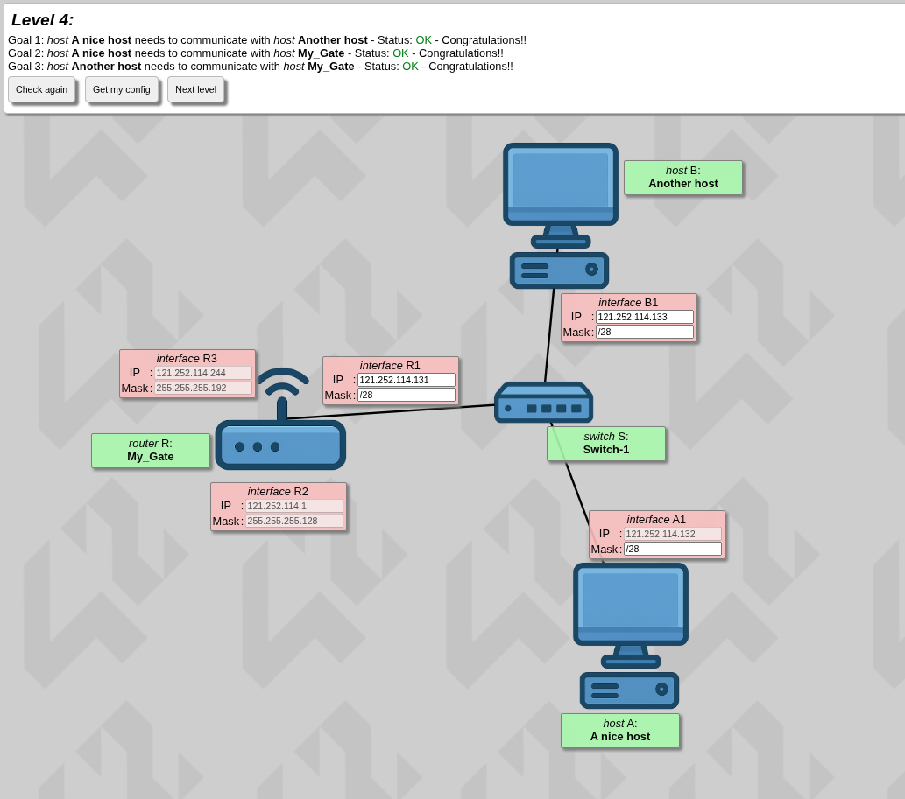

First encounter with routing between different networks.

**📘 Learning Concepts:**
* Understanding the role of a router
* Connecting multiple networks via router interfaces
* Choosing appropriate subnet masks
* Assigning IP addresses within the same network
* Using only relevant router interfaces for communication

---

### Level 5 - Complex Routing
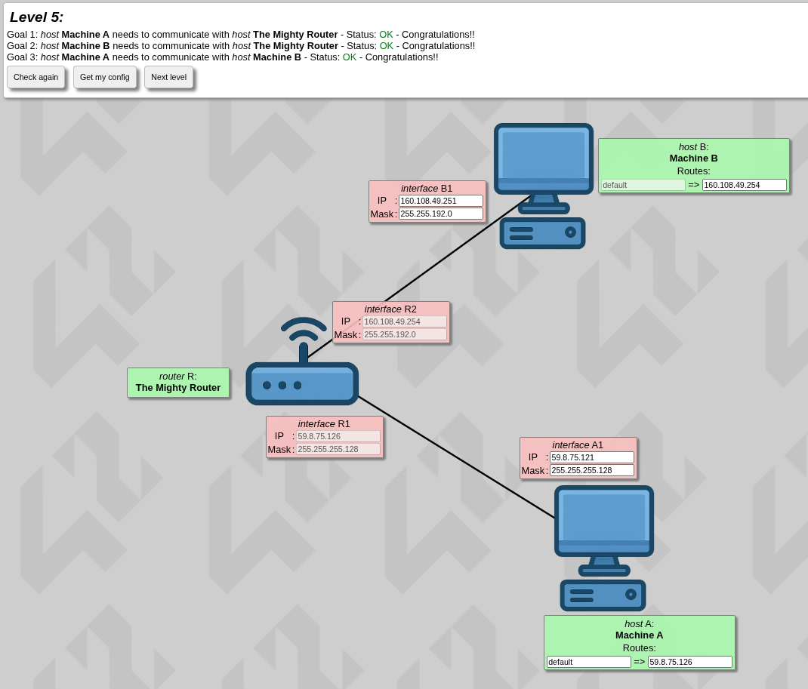

Advanced routing configurations and path selection.

**📘 Learning Concepts:**
* Understanding routes, destinations, and next hops
* Using default routes (`0.0.0.0/0`)
* Forwarding packets to other networks
* Identifying correct next hop interfaces

---

### Level 6 - Internet Gateway
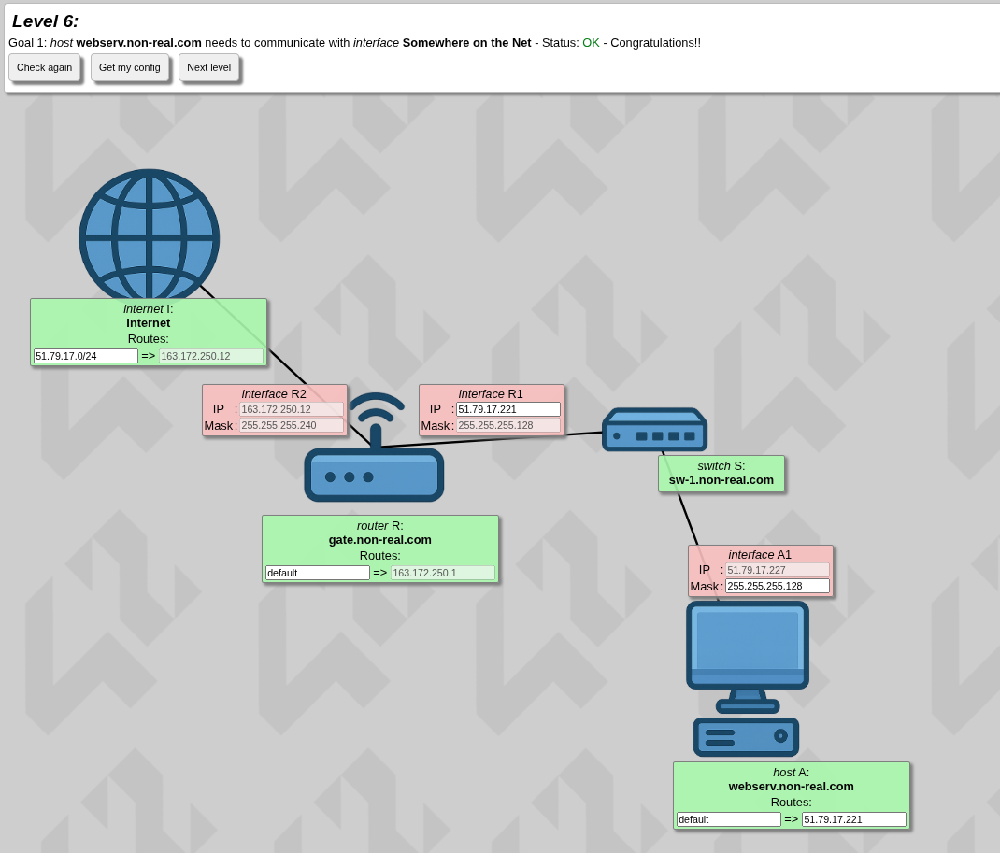

Connect local networks to external internet destinations.

**📘 Learning Concepts:**
* Understanding the internet as a routing entity
* Distinguishing private vs. public IP ranges
* Applying routing to reach external networks
* Determining destination networks using subnet masks

---

### Level 7 - Multi-Router Networks
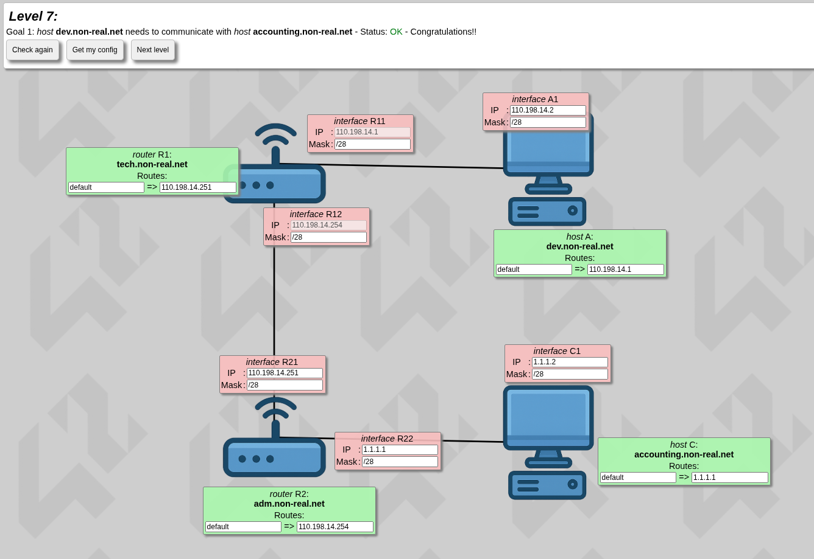

Manage communication across multiple router hops.

**📘 Learning Concepts:**
* Avoiding overlapping IP address ranges
* Recognizing routers as network boundaries
* Using subnetting to create multiple non-overlapping networks
* Assigning IP addresses correctly across routed networks

---

### Level 8 - Advanced Topologies
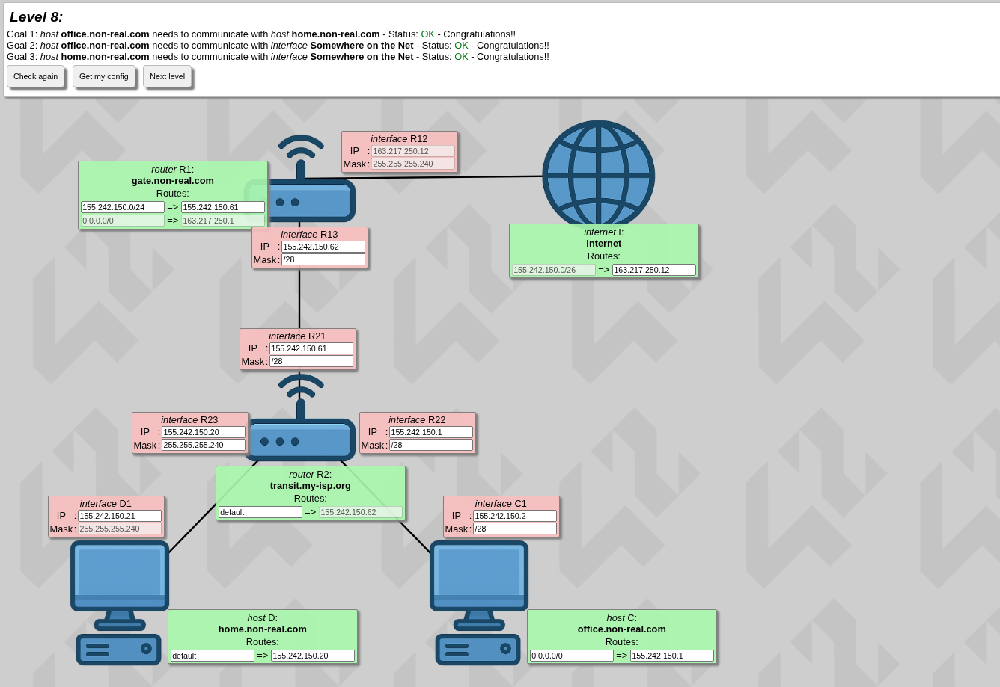

Complex network designs with multiple interconnected segments.

**📘 Learning Concepts:**
* Understanding end-to-end packet flow to and from the internet
* Avoiding overlapping IP ranges across multiple networks
* Using subnetting (/26, /28) to split larger networks into smaller non-overlapping ranges
* Assigning IP ranges to routers and hosts correctly
* Configuring next hop addresses for proper routing

---

### Level 9 - Enterprise Networks
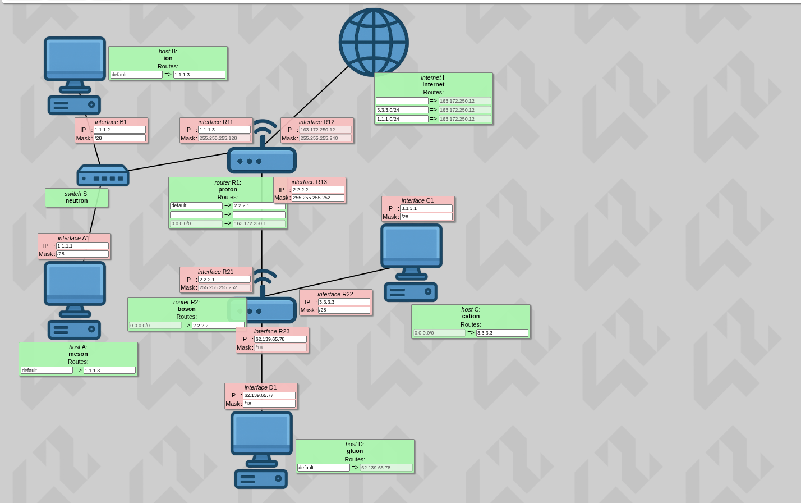

Large-scale network architecture simulation.

**📘 Learning Concepts:**
* Connecting multiple networks to the internet independently
* Understanding that not all routing table entries need to be filled
* Using network addresses to allow the internet to respond to hosts
* Avoiding private IP ranges for internet-facing connections
* Applying step-by-step network goals to configure routing

---

### Level 10 - Master Challenge
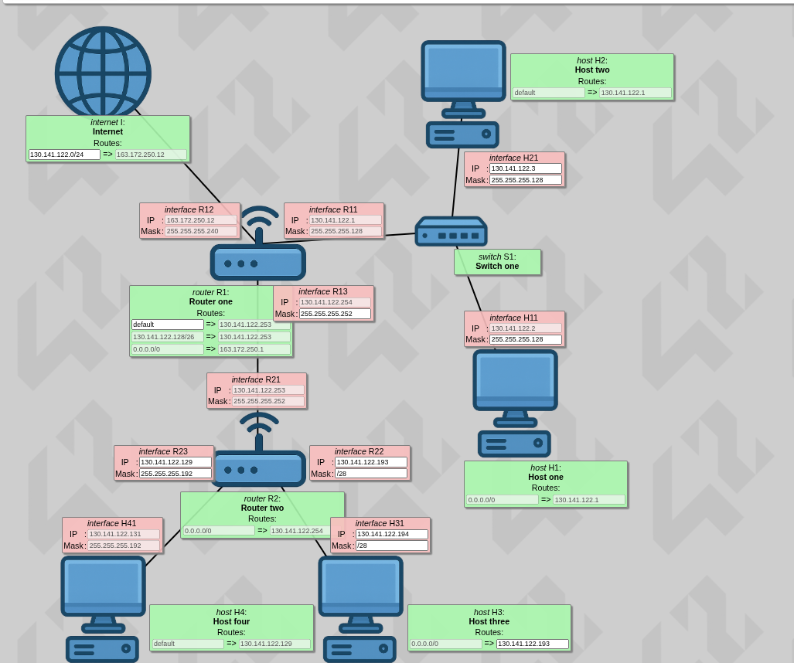

The ultimate networking configuration challenge combining all concepts.

**📘 Learning Concepts:**
* Managing multiple networks simultaneously
* Ensuring internet destinations cover all host networks
* Avoiding overlapping IP ranges across networks
* Using subnet masks to allocate IP ranges for different network segments
* Assigning IP addresses to interfaces while respecting existing entries

---

## 🔗 Documentation & Tutorials

### 🔗 Documentation & Tutorials

- [RFC 791 - Internet Protocol](https://tools.ietf.org/html/rfc791) - Official IPv4 specification
- [Subnet Calculator Tools](https://www.subnet-calculator.com/) - Visual subnet planning
- [Cisco Networking Basics](https://www.cisco.com/c/en/us/solutions/small-business/resource-center/networking/networking-basics.html) - Fundamental concepts
- [TCP/IP Guide](http://www.tcpipguide.com/) - Comprehensive protocol reference
- [Visual Subnet Calculator](https://www.davidc.net/sites/default/subnets/subnets.html) - Interactive learning tool
- [OSI Model - Wikipedia](https://en.wikipedia.org/wiki/OSI_model)
- [Cloudflare - What is the OSI Model?](https://www.cloudflare.com/learning/ddos/glossary/open-systems-interconnection-model-osi/)

---

### 📝 Articles & Guides

- **"Understanding IP Addressing and CIDR Charts"** - Subnetting fundamentals
- **"Routing Tables Explained"** - How routers make forwarding decisions
- **"Private IP Address Ranges (RFC 1918)"** - Reserved address space usage
- **"Binary to Decimal Conversion for Network Engineers"** - Essential math skills

---

### 🎥 Video Resources

- **NetworkChuck** - Subnetting tutorials
- **Professor Messer** - Network+ training series
- **Sunny Classroom** - TCP/IP playlist

#### Ethical Considerations:

AI was used as a learning accelerator and reference tool, similar to consulting documentation or textbooks. All core networking work, problem-solving, and configuration decisions were completed independently to ensure genuine understanding of the material and compliance with 42 academic integrity standards.

---

## ⚠️ Common Pitfalls

| Issue | Description |
|-------|-------------|
| **Overlapping Subnets** | Ensure each network segment has a unique address range |
| **Incorrect Subnet Masks** | Mismatched masks prevent proper communication |
| **Missing Routes** | Routers need explicit routes to reach non-directly-connected networks |
| **Reserved Addresses** | Cannot use network address (.0) or broadcast address (.255) |
| **Gateway Misplacement** | Default gateway must be within the same subnet as the host |

---

## ✅ Evaluation Criteria

The project is evaluated based on:

- ✓ Correct IP address configuration on all interfaces
- ✓ Proper subnet mask calculation and application
- ✓ Functional routing table entries
- ✓ No overlapping network ranges
- ✓ Efficient use of IP address space
- ✓ All hosts can communicate as required by each level

---

## 👤 Author

**El hassane el m'barki**  
*42 Student* - `elel-m-b`

---

## 🙏 Acknowledgments

- **42 Network** for the project design and web interface
- **The open-source networking community** for extensive documentation
- **Fellow 42 students** for collaborative learning and discussion

---

*For questions or suggestions, please open an issue on the repository.*
