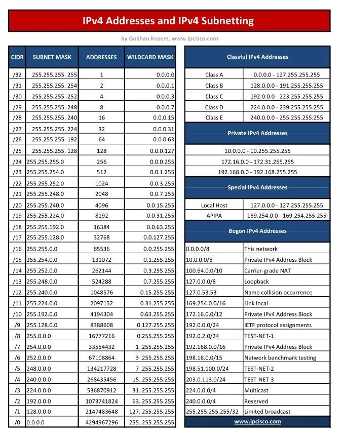
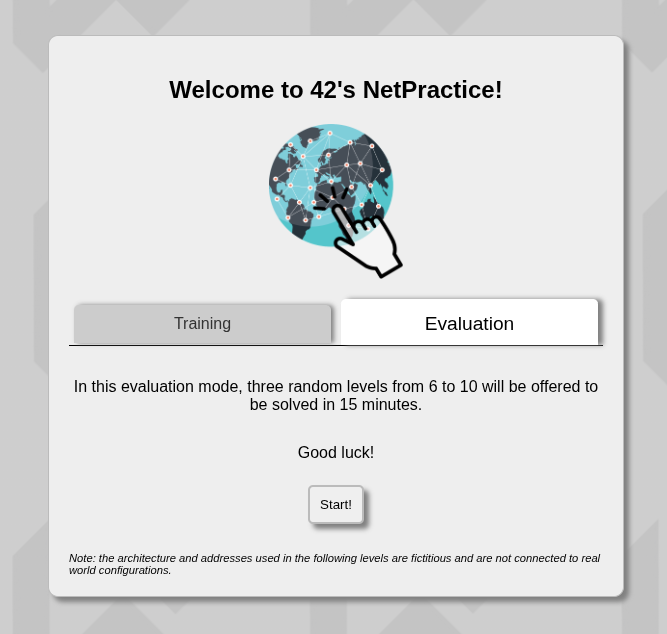
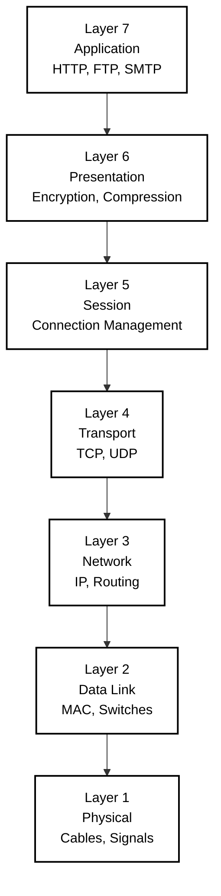
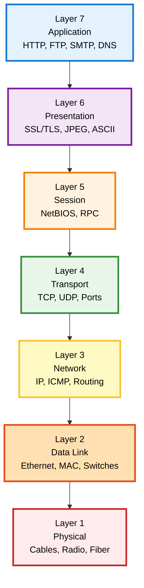
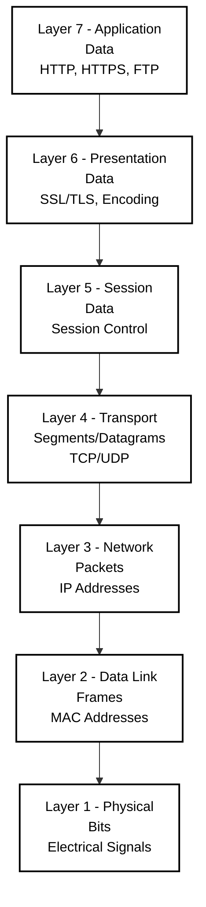
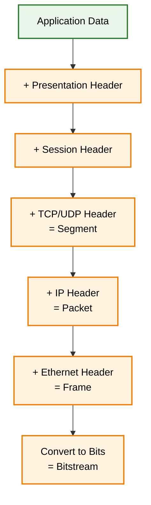
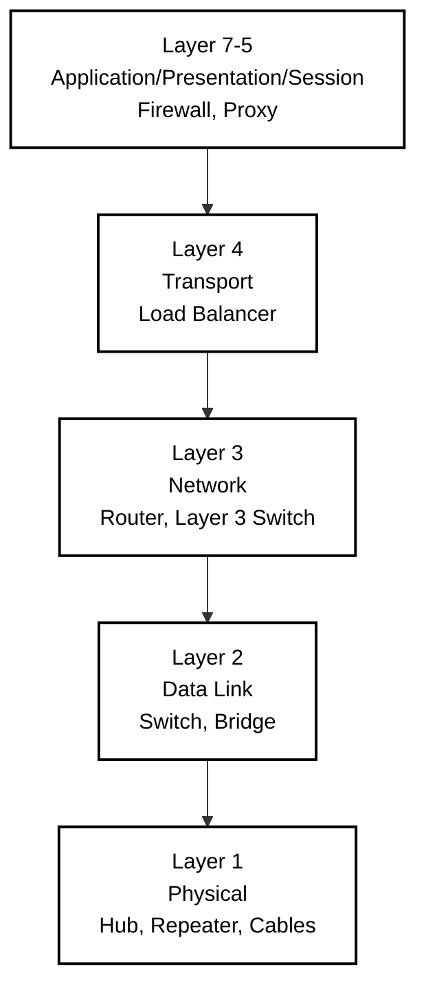

<div align="center">

# 🌐 NetPractice Made Simple

*This project has been created as part of the 42 curriculum by elel-m-b*


---
</div>

## 📖 Description

NetPractice is a network configuration training project designed to develop practical understanding of TCP/IP addressing and network topology. The project presents a series of networking exercises where you configure network devices to establish proper communication between hosts.

The goal is to master fundamental networking concepts by solving increasingly complex scenarios involving IP addressing, subnet masks, routing tables, and network segmentation. Each level requires configuring network interfaces, routers, and establishing routes to ensure all devices can communicate according to specific requirements.

Through hands-on problem-solving, this project builds essential skills for network administration, system configuration, and understanding how data flows across interconnected systems.

---

## 🚀 Instructions

### Prerequisites
- A web browser (Chrome, Firefox, Safari, or Edge)
- Basic understanding of binary and hexadecimal numbering systems

### Installation

```bash
# Clone the repository
git clone https://github.com/yourusername/netpractice.git
cd netpractice
```

No compilation required — this is a web-based training interface.

### Execution

1. Open `index.html` in your web browser
2. Navigate through the 10 levels using the interface
3. For each level:
   - Analyze the network topology diagram
   - Fill in the missing IP addresses, subnet masks, and routes
   - Click "Check again" to validate your configuration
   - Export your solution using the "Export" button when correct

### 💡 Usage Tips

- Start with the interfaces closest to the destination
- Calculate subnet ranges carefully to avoid overlapping networks
- Remember that routers connect different networks
- Use the smallest possible subnet that accommodates the required hosts
- Default route (0.0.0.0/0) can simplify routing table entries

---

## ✨ Features

| Feature | Description |
|---------|-------------|
| **10 Progressive Levels** | Gradually increasing difficulty from basic IP configuration to complex routing scenarios |
| **Interactive Network Diagrams** | Visual representation of hosts, switches, routers, and their connections |
| **Real-time Validation** | Immediate feedback on configuration correctness |
| **Export/Import Functionality** | Save and load your solutions for review |
| **Practical Application** | Simulates real-world networking challenges |

---

## 🎯 Project Levels

Navigate through 10 progressive networking challenges, each building upon previous concepts:

### Level 1 - Basic IP Configuration


Introduction to IP addressing and basic network connectivity.

---

### Level 2 - Subnet Fundamentals


Learn subnet mask calculations and network segmentation.

---

### Level 3 - Multiple Networks


Configure multiple isolated network segments.

---

### Level 4 - Router Introduction


First encounter with routing between different networks.

---

### Level 5 - Complex Routing


Advanced routing configurations and path selection.

---

### Level 6 - Internet Gateway


Connect local networks to external internet destinations.

---

### Level 7 - Multi-Router Networks


Manage communication across multiple router hops.

---

### Level 8 - Advanced Topologies


Complex network designs with multiple interconnected segments.

---

### Level 9 - Enterprise Networks


Large-scale network architecture simulation.

---

### Level 10 - Master Challenge


The ultimate networking configuration challenge combining all concepts.

---

## 📊 Additional Resources

<div align="center">

### Subnetting Reference


### Evaluation Criteria


</div>

---

## 🔌 OSI Model Reference

### The 7-Layer Network Architecture



### Overview

The **OSI (Open Systems Interconnection) Model** is a conceptual framework that standardizes network communication into 7 distinct layers. Each layer has specific responsibilities and communicates with the layers directly above and below it.

---

### Alternative OSI Visualizations

#### Color-Coded OSI Model



#### OSI Model with PDU Names



#### Encapsulation Process



#### Network Devices by OSI Layer



### 🔗 Documentation & Tutorials

- [RFC 791 - Internet Protocol](https://tools.ietf.org/html/rfc791) - Official IPv4 specification
- [Subnet Calculator Tools](https://www.subnet-calculator.com/) - Visual subnet planning
- [Cisco Networking Basics](https://www.cisco.com/c/en/us/solutions/small-business/resource-center/networking/networking-basics.html) - Fundamental concepts
- [TCP/IP Guide](http://www.tcpipguide.com/) - Comprehensive protocol reference
- [Visual Subnet Calculator](https://www.davidc.net/sites/default/subnets/subnets.html) - Interactive learning tool
- [OSI Model - Wikipedia](https://en.wikipedia.org/wiki/OSI_model)
- [Cloudflare - What is the OSI Model?](https://www.cloudflare.com/learning/ddos/glossary/open-systems-interconnection-model-osi/)

---

### 📝 Articles & Guides

- **"Understanding IP Addressing and CIDR Charts"** - Subnetting fundamentals
- **"Routing Tables Explained"** - How routers make forwarding decisions
- **"Private IP Address Ranges (RFC 1918)"** - Reserved address space usage
- **"Binary to Decimal Conversion for Network Engineers"** - Essential math skills

---

### 🎥 Video Resources

- **NetworkChuck** - Subnetting tutorials
- **Professor Messer** - Network+ training series
- **Sunny Classroom** - TCP/IP playlist

#### Ethical Considerations:

AI was used as a learning accelerator and reference tool, similar to consulting documentation or textbooks. All core networking work, problem-solving, and configuration decisions were completed independently to ensure genuine understanding of the material and compliance with 42 academic integrity standards.

---

## ⚠️ Common Pitfalls

| Issue | Description |
|-------|-------------|
| **Overlapping Subnets** | Ensure each network segment has a unique address range |
| **Incorrect Subnet Masks** | Mismatched masks prevent proper communication |
| **Missing Routes** | Routers need explicit routes to reach non-directly-connected networks |
| **Reserved Addresses** | Cannot use network address (.0) or broadcast address (.255) |
| **Gateway Misplacement** | Default gateway must be within the same subnet as the host |

---

## ✅ Evaluation Criteria

The project is evaluated based on:

- ✓ Correct IP address configuration on all interfaces
- ✓ Proper subnet mask calculation and application
- ✓ Functional routing table entries
- ✓ No overlapping network ranges
- ✓ Efficient use of IP address space
- ✓ All hosts can communicate as required by each level

---

## 👤 Author

**El hassane el m'barki**  
*42 Student* - `elel-m-b`

---

## 🙏 Acknowledgments

- **42 Network** for the project design and web interface
- **The open-source networking community** for extensive documentation
- **Fellow 42 students** for collaborative learning and discussion

---

*For questions or suggestions, please open an issue on the repository.*
