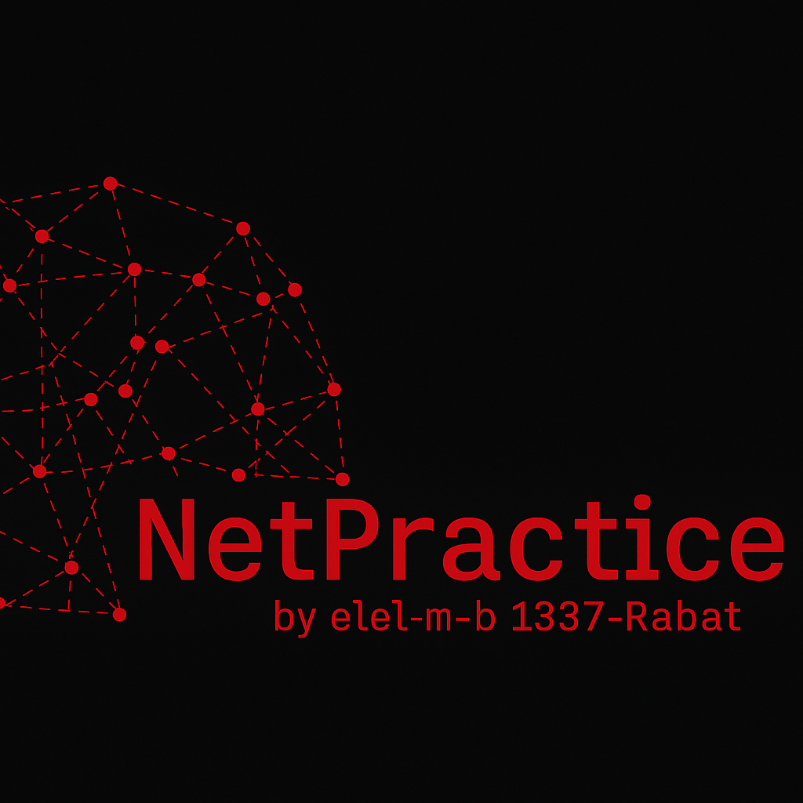
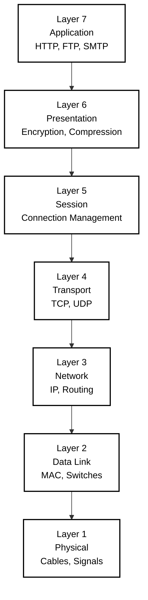

<div align="center">

# 🌐 NetPractice Made Simple

*This project has been created as part of the 42 curriculum by elel-m-b*



---
</div>
## 📖 Description

NetPractice is a network configuration training project designed to develop practical understanding of TCP/IP addressing and network topology. The project presents a series of networking exercises where you configure network devices to establish proper communication between hosts.

The goal is to master fundamental networking concepts by solving increasingly complex scenarios involving IP addressing, subnet masks, routing tables, and network segmentation. Each level requires configuring network interfaces, routers, and establishing routes to ensure all devices can communicate according to specific requirements.

Through hands-on problem-solving, this project builds essential skills for network administration, system configuration, and understanding how data flows across interconnected systems.

---

## 🚀 Instructions

### Prerequisites
- A web browser (Chrome, Firefox, Safari, or Edge)
- Basic understanding of binary and hexadecimal numbering systems

### Installation

```bash
# Clone the repository
git clone https://github.com/yourusername/netpractice.git
cd netpractice
```

No compilation required — this is a web-based training interface.

### Execution

1. Open `index.html` in your web browser
2. Navigate through the 10 levels using the interface
3. For each level:
   - Analyze the network topology diagram
   - Fill in the missing IP addresses, subnet masks, and routes
   - Click "Check again" to validate your configuration
   - Export your solution using the "Export" button when correct

### 💡 Usage Tips

- Start with the interfaces closest to the destination
- Calculate subnet ranges carefully to avoid overlapping networks
- Remember that routers connect different networks
- Use the smallest possible subnet that accommodates the required hosts
- Default route (0.0.0.0/0) can simplify routing table entries

---

## ✨ Features

| Feature | Description |
|---------|-------------|
| **10 Progressive Levels** | Gradually increasing difficulty from basic IP configuration to complex routing scenarios |
| **Interactive Network Diagrams** | Visual representation of hosts, switches, routers, and their connections |
| **Real-time Validation** | Immediate feedback on configuration correctness |
| **Export/Import Functionality** | Save and load your solutions for review |
| **Practical Application** | Simulates real-world networking challenges |

---

## 🔌 OSI Model Reference

### The 7-Layer Network Architecture



### Overview

The **OSI (Open Systems Interconnection) Model** is a conceptual framework that standardizes network communication into 7 distinct layers. Each layer has specific responsibilities and communicates with the layers directly above and below it.

---

## 📚 Layer Descriptions

### 🔷 Layer 7 - Application
**What users interact with**
- **Protocols:** HTTP, HTTPS, FTP, SMTP, DNS
- **Purpose:** Where applications access network services
- **Example:** Web browsers, email clients

### 🔷 Layer 6 - Presentation
**Data translation and encryption**
- **Functions:** Converts data formats between application and network
- **Operations:** Encryption/decryption, data compression
- **Example:** SSL/TLS, JPEG, ASCII

### 🔷 Layer 5 - Session
**Connection management**
- **Functions:** Establishes, maintains, and terminates sessions
- **Operations:** Synchronization and dialog control
- **Example:** NetBIOS, RPC

### 🔷 Layer 4 - Transport
**End-to-end communication**
- **Protocols:** TCP (reliable), UDP (fast)
- **Functions:** Segmentation and flow control
- **Details:** Port numbers (0-65535)
- **Example:** TCP port 80 for HTTP

### 🔷 Layer 3 - Network
**Routing and addressing**
- **Protocols:** IP, ICMP, routing protocols
- **Functions:** Logical addressing (IP addresses)
- **Operations:** Packet forwarding between networks
- **Example:** Routers operate here

### 🔷 Layer 2 - Data Link
**Node-to-node transfer**
- **Protocols:** Ethernet, Wi-Fi (802.11)
- **Addressing:** MAC addresses
- **Functions:** Error detection
- **Example:** Switches operate here

### 🔷 Layer 1 - Physical
**Physical transmission**
- **Medium:** Cables, wireless signals
- **Signals:** Electrical/optical signals
- **Hardware:** Network hardware
- **Example:** Ethernet cables, fiber optics, radio waves

---

## 🧠 Mnemonic to Remember

**Top to Bottom:** *"All People Seem To Need Data Processing"*

**Bottom to Top:** *"Please Do Not Throw Sausage Pizza Away"*

---

## 🔄 Data Flow

```
Application Layer    →  Data
Presentation Layer   →  Data
Session Layer        →  Data
Transport Layer      →  Segments
Network Layer        →  Packets
Data Link Layer      →  Frames
Physical Layer       →  Bits
```

---

## 🔑 Key Concepts

| Concept | Description |
|---------|-------------|
| **Encapsulation** | Each layer adds its own header as data moves down |
| **Decapsulation** | Headers are removed as data moves up |
| **PDU (Protocol Data Unit)** | Data at each layer has a specific name |
| **Peer Communication** | Each layer communicates with its corresponding layer on the receiving end |

---

## 🌐 Common Protocols by Layer

| Layer | Protocols |
|-------|-----------|
| **7 - Application** | HTTP, HTTPS, FTP, SMTP, DNS, SSH |
| **6 - Presentation** | SSL/TLS, MIME, JPEG, GIF |
| **5 - Session** | NetBIOS, PPTP, RPC |
| **4 - Transport** | TCP, UDP |
| **3 - Network** | IP, ICMP, ARP, OSPF, BGP |
| **2 - Data Link** | Ethernet, PPP, 802.11 (Wi-Fi) |
| **1 - Physical** | Ethernet cables, USB, Bluetooth |

---

## 🛠️ Technical Concepts

### Network Architecture
- **Client-Server Model:** Understanding host communication patterns
- **Network Segmentation:** Dividing networks into logical subnets
- **Routing:** Path determination between different networks
- **Interface Configuration:** Assigning addresses to network interfaces

### Addressing Schemes
- **IPv4 Structure:** 32-bit addresses in dotted-decimal notation
- **Private Address Ranges:** 10.0.0.0/8, 172.16.0.0/12, 192.168.0.0/16
- **Special Addresses:** Network address, broadcast address, loopback (127.0.0.1)
- **Classful vs Classless:** Traditional classes and modern CIDR notation

### Subnetting Strategy
- **CIDR Notation:** Prefix length notation (/24, /25, /30, etc.)
- **Subnet Calculation:** Determining network size and valid host ranges
- **Variable Length Subnet Masking (VLSM):** Efficient IP address allocation
- **Subnet Optimization:** Minimizing address waste while meeting requirements

---

## 📚 Resources

### Networking Fundamentals

#### TCP/IP Protocol Suite
- TCP/IP addressing and structure (32-bit IPv4 addresses)
- Subnet masks and network/host bit division
- Default gateway configuration for inter-network communication
- Network Address Translation (NAT) concepts

#### Network Devices
- **Routers:** Layer 3 devices connecting different networks, maintaining routing tables
- **Switches:** Layer 2 devices forwarding frames within a network segment
- **Interfaces:** Network interface cards (NICs) with unique IP configurations

#### OSI Model Layers
- **Layer 2 (Data Link):** MAC addressing, switches, frame forwarding
- **Layer 3 (Network):** IP addressing, routing, logical network topology
- **Layer 4 (Transport):** TCP/UDP, port numbers, connection management

#### Subnetting Concepts
- CIDR (Classless Inter-Domain Routing) notation
- Subnet mask calculation and binary conversion
- Network address, broadcast address, and usable host range determination
- Supernetting and route aggregation

---

### 🔗 Documentation & Tutorials

- [RFC 791 - Internet Protocol](https://tools.ietf.org/html/rfc791) - Official IPv4 specification
- [Subnet Calculator Tools](https://www.subnet-calculator.com/) - Visual subnet planning
- [Cisco Networking Basics](https://www.cisco.com/c/en/us/solutions/small-business/resource-center/networking/networking-basics.html) - Fundamental concepts
- [TCP/IP Guide](http://www.tcpipguide.com/) - Comprehensive protocol reference
- [Visual Subnet Calculator](https://www.davidc.net/sites/default/subnets/subnets.html) - Interactive learning tool
- [OSI Model - Wikipedia](https://en.wikipedia.org/wiki/OSI_model)
- [Cloudflare - What is the OSI Model?](https://www.cloudflare.com/learning/ddos/glossary/open-systems-interconnection-model-osi/)

---

### 📝 Articles & Guides

- **"Understanding IP Addressing and CIDR Charts"** - Subnetting fundamentals
- **"Routing Tables Explained"** - How routers make forwarding decisions
- **"Private IP Address Ranges (RFC 1918)"** - Reserved address space usage
- **"Binary to Decimal Conversion for Network Engineers"** - Essential math skills

---

### 🎥 Video Resources

- **NetworkChuck** - Subnetting tutorials
- **Professor Messer** - Network+ training series
- **Sunny Classroom** - TCP/IP playlist

---

### 🤖 AI Usage in This Project

#### Claude AI (Anthropic) was used for:

- **Concept Research:** Clarifying complex networking concepts such as CIDR notation, VLSM, and routing table mechanics
- **Documentation Review:** Summarizing RFC documents and technical specifications for quicker understanding
- **Problem-Solving Assistance:** Debugging subnet calculations and verifying routing configurations
- **Calculation Verification:** Double-checking binary-to-decimal conversions and subnet math
- **Resource Curation:** Identifying high-quality learning materials and documentation sources
- **README Structure:** Organizing and formatting this documentation file

#### Tasks Performed Without AI:

- All network configurations and solutions for the 10 levels
- Subnet calculations and IP address planning
- Routing table design and optimization
- Understanding and application of networking principles
- Testing and validation of all configurations

#### Ethical Considerations:

AI was used as a learning accelerator and reference tool, similar to consulting documentation or textbooks. All core networking work, problem-solving, and configuration decisions were completed independently to ensure genuine understanding of the material and compliance with 42 academic integrity standards.

---

## ⚠️ Common Pitfalls

| Issue | Description |
|-------|-------------|
| **Overlapping Subnets** | Ensure each network segment has a unique address range |
| **Incorrect Subnet Masks** | Mismatched masks prevent proper communication |
| **Missing Routes** | Routers need explicit routes to reach non-directly-connected networks |
| **Reserved Addresses** | Cannot use network address (.0) or broadcast address (.255) |
| **Gateway Misplacement** | Default gateway must be within the same subnet as the host |

---

## ✅ Evaluation Criteria

The project is evaluated based on:

- ✓ Correct IP address configuration on all interfaces
- ✓ Proper subnet mask calculation and application
- ✓ Functional routing table entries
- ✓ No overlapping network ranges
- ✓ Efficient use of IP address space
- ✓ All hosts can communicate as required by each level

---

## 👤 Author

**El hassane el m'barki**  
*42 Student* - `elel-m-b`

---

## 🙏 Acknowledgments

- **42 Network** for the project design and web interface
- **The open-source networking community** for extensive documentation
- **Fellow 42 students** for collaborative learning and discussion

---

*For questions or suggestions, please open an issue on the repository.*
